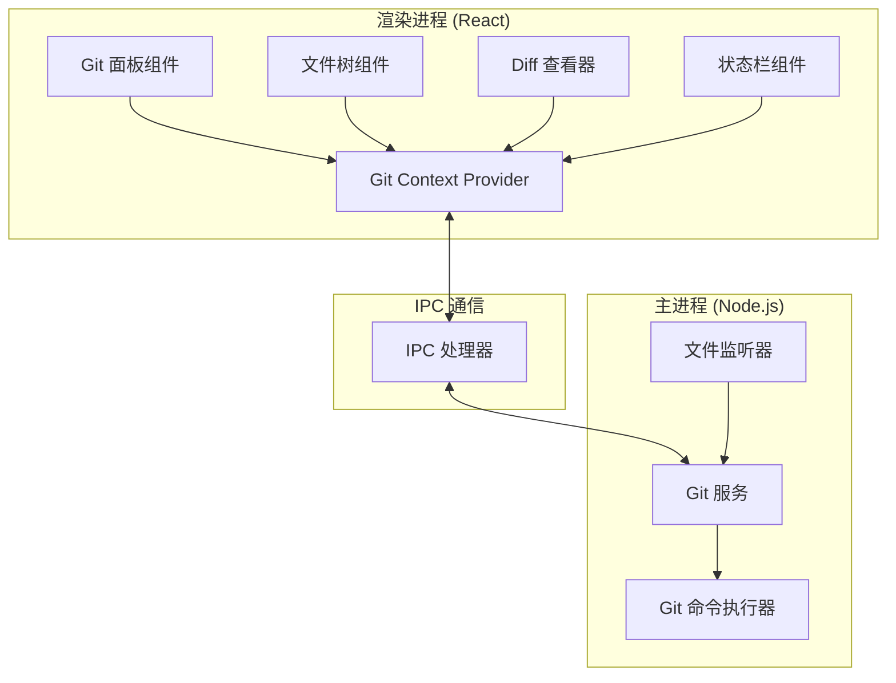
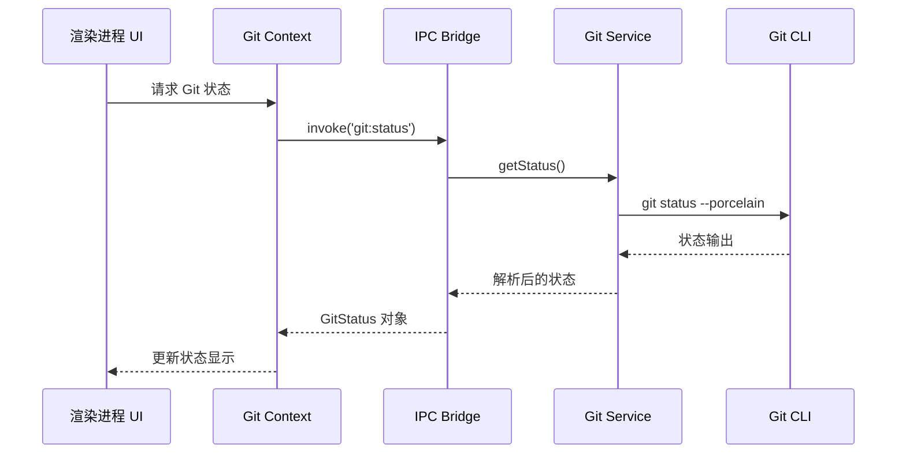

# 设计文档

## 概述

本设计文档描述 MindCode 编辑器 Git 集成功能的技术实现方案。该功能采用 Electron 的主进程/渲染进程架构，主进程负责执行 Git 命令，渲染进程负责 UI 展示。通过 IPC 通信实现两者之间的数据交换。

## 架构

### 整体架构图



### 数据流



## 组件和接口

### 主进程组件

#### GitService (src/main/services/git.ts)

Git 服务是主进程中的核心模块，负责所有 Git 操作。

```typescript
interface GitService {
  // 仓库检测
  isGitRepository(workspacePath: string): Promise<boolean>;
  initRepository(workspacePath: string): Promise<GitResult>;
  
  // 状态查询
  getStatus(workspacePath: string): Promise<GitStatus>;
  getDiff(workspacePath: string, filePath: string): Promise<GitDiff>;
  getDiffStaged(workspacePath: string, filePath: string): Promise<GitDiff>;
  
  // 暂存操作
  stage(workspacePath: string, filePaths: string[]): Promise<GitResult>;
  unstage(workspacePath: string, filePaths: string[]): Promise<GitResult>;
  stageAll(workspacePath: string): Promise<GitResult>;
  discardChanges(workspacePath: string, filePaths: string[]): Promise<GitResult>;
  
  // 提交操作
  commit(workspacePath: string, message: string): Promise<GitResult>;
  
  // 分支操作
  getBranches(workspacePath: string): Promise<GitBranch[]>;
  getCurrentBranch(workspacePath: string): Promise<string>;
  checkout(workspacePath: string, branchName: string): Promise<GitResult>;
  createBranch(workspacePath: string, branchName: string): Promise<GitResult>;
  
  // 历史查询
  getLog(workspacePath: string, options?: GitLogOptions): Promise<GitCommit[]>;
  getCommitDiff(workspacePath: string, commitHash: string): Promise<GitCommitDetail>;
}
```

#### IPC 处理器 (src/main/index.ts)

新增 Git 相关的 IPC 处理器：

```typescript
// Git IPC 通道
const GIT_CHANNELS = {
  IS_REPO: 'git:isRepo',
  INIT: 'git:init',
  STATUS: 'git:status',
  DIFF: 'git:diff',
  DIFF_STAGED: 'git:diffStaged',
  STAGE: 'git:stage',
  UNSTAGE: 'git:unstage',
  STAGE_ALL: 'git:stageAll',
  DISCARD: 'git:discard',
  COMMIT: 'git:commit',
  BRANCHES: 'git:branches',
  CURRENT_BRANCH: 'git:currentBranch',
  CHECKOUT: 'git:checkout',
  CREATE_BRANCH: 'git:createBranch',
  LOG: 'git:log',
  COMMIT_DETAIL: 'git:commitDetail',
} as const;
```

### 渲染进程组件

#### GitContext (src/renderer/contexts/GitContext.tsx)

React Context 用于管理 Git 状态和提供操作方法：

```typescript
interface GitContextValue {
  // 状态
  isRepo: boolean;
  isLoading: boolean;
  currentBranch: string;
  status: GitStatus | null;
  branches: GitBranch[];
  commits: GitCommit[];
  error: string | null;
  
  // 操作方法
  refresh(): Promise<void>;
  stage(filePaths: string[]): Promise<void>;
  unstage(filePaths: string[]): Promise<void>;
  stageAll(): Promise<void>;
  discardChanges(filePaths: string[]): Promise<void>;
  commit(message: string): Promise<void>;
  checkout(branchName: string): Promise<void>;
  createBranch(branchName: string): Promise<void>;
  getDiff(filePath: string): Promise<GitDiff>;
  loadMoreCommits(): Promise<void>;
}
```

#### GitPanel (src/renderer/components/GitPanel.tsx)

Git 侧边栏面板组件：

```typescript
interface GitPanelProps {
  workspacePath: string;
}

// 子组件
// - GitPanelHeader: 显示分支选择器
// - GitChanges: 显示暂存区和工作区更改
// - GitCommitForm: 提交消息输入和提交按钮
// - GitHistory: 提交历史列表
```

#### DiffViewer (src/renderer/components/DiffViewer.tsx)

基于 Monaco Editor 的差异对比组件：

```typescript
interface DiffViewerProps {
  original: string;
  modified: string;
  originalPath: string;
  modifiedPath: string;
  language?: string;
}
```

### Preload API 扩展 (src/main/preload.ts)

```typescript
interface GitAPI {
  isRepo: (workspacePath: string) => Promise<{ success: boolean; data?: boolean; error?: string }>;
  init: (workspacePath: string) => Promise<GitResult>;
  status: (workspacePath: string) => Promise<{ success: boolean; data?: GitStatus; error?: string }>;
  diff: (workspacePath: string, filePath: string) => Promise<{ success: boolean; data?: GitDiff; error?: string }>;
  diffStaged: (workspacePath: string, filePath: string) => Promise<{ success: boolean; data?: GitDiff; error?: string }>;
  stage: (workspacePath: string, filePaths: string[]) => Promise<GitResult>;
  unstage: (workspacePath: string, filePaths: string[]) => Promise<GitResult>;
  stageAll: (workspacePath: string) => Promise<GitResult>;
  discard: (workspacePath: string, filePaths: string[]) => Promise<GitResult>;
  commit: (workspacePath: string, message: string) => Promise<GitResult>;
  branches: (workspacePath: string) => Promise<{ success: boolean; data?: GitBranch[]; error?: string }>;
  currentBranch: (workspacePath: string) => Promise<{ success: boolean; data?: string; error?: string }>;
  checkout: (workspacePath: string, branchName: string) => Promise<GitResult>;
  createBranch: (workspacePath: string, branchName: string) => Promise<GitResult>;
  log: (workspacePath: string, options?: GitLogOptions) => Promise<{ success: boolean; data?: GitCommit[]; error?: string }>;
  commitDetail: (workspacePath: string, commitHash: string) => Promise<{ success: boolean; data?: GitCommitDetail; error?: string }>;
}
```

## 数据模型

### GitStatus

```typescript
interface GitStatus {
  staged: GitFileChange[];      // 已暂存的文件
  unstaged: GitFileChange[];    // 未暂存的修改
  untracked: GitFileChange[];   // 未跟踪的文件
  conflicted: GitFileChange[];  // 有冲突的文件
}

interface GitFileChange {
  path: string;                 // 文件相对路径
  status: GitFileStatus;        // 文件状态
  oldPath?: string;             // 重命名时的原路径
}

type GitFileStatus = 
  | 'modified'      // M - 已修改
  | 'added'         // A - 已添加
  | 'deleted'       // D - 已删除
  | 'renamed'       // R - 已重命名
  | 'copied'        // C - 已复制
  | 'untracked'     // ? - 未跟踪
  | 'ignored'       // ! - 已忽略
  | 'conflicted';   // U - 有冲突
```

### GitDiff

```typescript
interface GitDiff {
  filePath: string;
  original: string;             // 原始内容
  modified: string;             // 修改后内容
  hunks: DiffHunk[];            // 差异块
}

interface DiffHunk {
  oldStart: number;
  oldLines: number;
  newStart: number;
  newLines: number;
  lines: DiffLine[];
}

interface DiffLine {
  type: 'add' | 'delete' | 'context';
  content: string;
  oldLineNumber?: number;
  newLineNumber?: number;
}
```

### GitBranch

```typescript
interface GitBranch {
  name: string;
  isCurrent: boolean;
  isRemote: boolean;
  upstream?: string;            // 上游分支
  ahead?: number;               // 领先提交数
  behind?: number;              // 落后提交数
}
```

### GitCommit

```typescript
interface GitCommit {
  hash: string;                 // 完整哈希
  shortHash: string;            // 短哈希 (7位)
  author: string;
  authorEmail: string;
  date: string;                 // ISO 格式日期
  message: string;              // 提交消息
  parentHashes: string[];       // 父提交哈希
}

interface GitCommitDetail extends GitCommit {
  files: GitFileChange[];       // 该提交涉及的文件
  stats: {
    additions: number;
    deletions: number;
    filesChanged: number;
  };
}
```

### GitResult

```typescript
interface GitResult {
  success: boolean;
  error?: string;
  data?: any;
}

interface GitLogOptions {
  maxCount?: number;            // 最大返回数量，默认 50
  skip?: number;                // 跳过数量，用于分页
  branch?: string;              // 指定分支
}
```


## 正确性属性

*正确性属性是一种应该在系统所有有效执行中保持为真的特征或行为——本质上是关于系统应该做什么的形式化陈述。属性作为人类可读规范和机器可验证正确性保证之间的桥梁。*

### Property 1: Git 状态解析正确性

*对于任何* 有效的 `git status --porcelain` 输出，解析函数应该正确识别每个文件的状态类型（modified、added、deleted、renamed、untracked、conflicted），并将其分类到正确的列表（staged、unstaged、untracked、conflicted）中。

**验证: 需求 2.2, 2.3, 2.4, 2.5, 2.6**

### Property 2: 暂存操作往返一致性

*对于任何* 已修改的文件集合，执行 stage 操作后再执行 unstage 操作，文件应该回到原始的未暂存状态；同样，对于任何已暂存的文件，执行 unstage 后再执行 stage，文件应该回到已暂存状态。

**验证: 需求 4.1, 4.2, 4.3**

### Property 3: 提交操作正确性

*对于任何* 非空的提交消息和非空的暂存区，执行 commit 操作后，暂存区应该为空，且 git log 的最新提交消息应该与输入的消息一致。对于空的提交消息，commit 操作应该失败并返回错误。

**验证: 需求 5.2, 5.3**

### Property 4: 分支操作正确性

*对于任何* 有效的分支名称，执行 createBranch 后 getBranches 应该包含该分支；执行 checkout 后 getCurrentBranch 应该返回该分支名称。

**验证: 需求 6.3, 6.5**

### Property 5: 提交历史解析正确性

*对于任何* 有效的 `git log` 输出，解析函数应该正确提取每条提交的 hash、shortHash、author、authorEmail、date 和 message 字段，且 shortHash 应该是 hash 的前 7 个字符。

**验证: 需求 7.2**

### Property 6: 仓库检测正确性

*对于任何* 文件系统路径，如果该路径下存在 `.git` 目录，isGitRepository 应该返回 true；否则应该返回 false。

**验证: 需求 1.1**

## 错误处理

### Git 命令执行错误

| 错误场景 | 处理方式 |
|---------|---------|
| Git 未安装 | 显示安装提示，禁用 Git 功能 |
| 非 Git 仓库 | 显示"初始化仓库"选项 |
| 命令执行超时 | 显示超时错误，允许重试 |
| 权限不足 | 显示权限错误提示 |
| 网络错误（远程操作） | 显示网络错误，允许重试 |

### 分支操作错误

| 错误场景 | 处理方式 |
|---------|---------|
| 分支名称无效 | 显示命名规则提示 |
| 分支已存在 | 显示"分支已存在"错误 |
| 有未提交更改时切换 | 显示警告对话框，提供暂存/放弃选项 |
| 合并冲突 | 显示冲突文件列表，提供解决冲突指引 |

### 提交操作错误

| 错误场景 | 处理方式 |
|---------|---------|
| 提交消息为空 | 阻止提交，显示错误提示 |
| 暂存区为空 | 阻止提交，显示"无更改可提交"提示 |
| 用户信息未配置 | 显示配置提示 |

## 测试策略

### 单元测试

单元测试用于验证具体示例和边界情况：

1. **Git 状态解析测试**
   - 测试各种 porcelain 格式输出的解析
   - 测试空输出、单文件、多文件场景
   - 测试特殊字符文件名处理

2. **Git 日志解析测试**
   - 测试标准日志格式解析
   - 测试合并提交解析
   - 测试空日志处理

3. **UI 组件测试**
   - 测试 GitPanel 在不同状态下的渲染
   - 测试 DiffViewer 的差异显示
   - 测试状态栏组件更新

### 属性测试

属性测试用于验证跨所有输入的通用属性。使用 fast-check 库进行属性测试。

**配置要求**：
- 每个属性测试最少运行 100 次迭代
- 每个测试必须用注释标注对应的设计文档属性
- 标注格式: `// Feature: git-integration, Property N: [属性标题]`

**属性测试列表**：

1. **Property 1 测试**: Git 状态解析
   - 生成随机的 porcelain 格式字符串
   - 验证解析结果的状态类型正确

2. **Property 2 测试**: 暂存操作往返
   - 生成随机文件路径列表
   - 验证 stage/unstage 往返一致性

3. **Property 3 测试**: 提交操作
   - 生成随机非空提交消息
   - 验证提交后状态正确

4. **Property 4 测试**: 分支操作
   - 生成随机有效分支名称
   - 验证创建和切换操作正确

5. **Property 5 测试**: 日志解析
   - 生成随机的 git log 格式输出
   - 验证解析结果字段完整

6. **Property 6 测试**: 仓库检测
   - 生成随机目录结构
   - 验证检测结果正确

### 集成测试

1. **端到端 Git 工作流测试**
   - 初始化仓库 → 创建文件 → 暂存 → 提交 → 查看历史
   - 创建分支 → 切换分支 → 合并分支

2. **IPC 通信测试**
   - 验证主进程和渲染进程之间的数据传递正确

